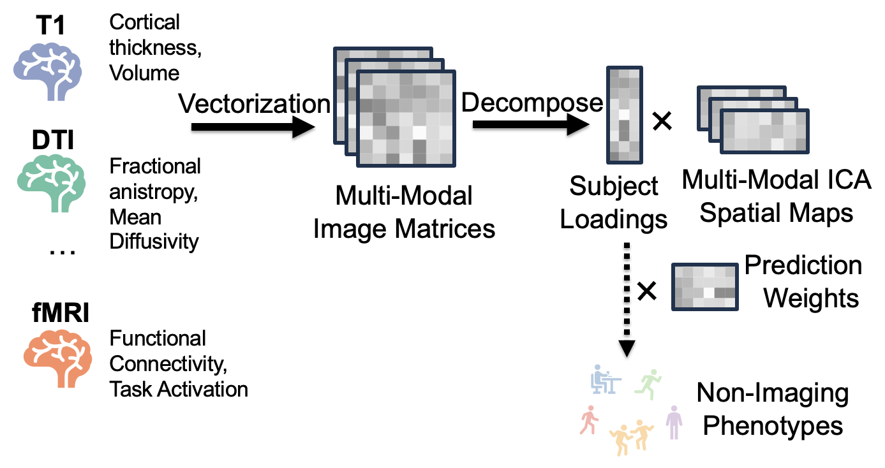

# SuperBigFLICA (SBF)

[](https://www.python.org/)
[](LICENSE)
[](https://www.medrxiv.org/content/10.64898/2025.12.11.25341830v1)

> **Semi-supervised multimodal neuroimaging data fusion** that simultaneously learns interpretable spatial brain components and predicts clinical outcomes — enabling both discovery and prediction from multi-modal brain imaging data.

<p align="center">
  
</p>

## Features

- Semi-supervised multimodal brain imaging fusion via joint matrix decomposition
- Simultaneously learns interpretable spatial brain components and predicts clinical outcomes
- Supports NIfTI (`.nii.gz`), FreeSurfer surface (`.mgh`), CIFTI (`.dtseries.nii`), and plain text matrix (`.txt`) inputs
- Train / validation / test split workflow with per-epoch validation tracking
- Saves spatial component maps in native file formats for direct use in neuroimaging tools

## Citation

SuperBigFLICA was originally proposed in:

> **Supervised Phenotype Discovery From Multimodal Brain Imaging**
> Weikang Gong, Shuang Bai, Yong-Qiang Zheng, Stephen M. Smith, Christian F. Beckmann
> *IEEE Transactions on Medical Imaging*, 42(3):834–849, 2023. https://doi.org/10.1109/TMI.2022.3218720

```bibtex
@article{gong2023supervised,
  title={Supervised Phenotype Discovery From Multimodal Brain Imaging},
  author={Gong, Weikang and Bai, Shuang and Zheng, Yong-Qiang and Smith, Stephen M. and Beckmann, Christian F.},
  journal={IEEE Transactions on Medical Imaging},
  volume={42},
  number={3},
  pages={834--849},
  year={2023},
  doi={10.1109/TMI.2022.3218720}
}
```

If you use this codebase in your research, please also cite:

> **Investigating the Amyloid-Tau-Neurodegeneration Framework in Alzheimer's Disease Using Semi-Supervised Multimodal Imaging Data Fusion**
> You Cheng, Adrián Medina, Cole Korponay, Christian F. Beckmann, David Harper, Lisa Nickerson, and the Alzheimer's Disease Neuroimaging Initiative
> *medRxiv*, 2025. https://doi.org/10.64898/2025.12.11.25341830

```bibtex
@article{cheng2025sbf,
  title={Investigating the Amyloid-Tau-Neurodegeneration Framework in Alzheimer's Disease Using Semi-Supervised Multimodal Imaging Data Fusion},
  author={Cheng, You and Medina, Adri{\'a}n and Korponay, Cole and Beckmann, Christian F. and Harper, David and Nickerson, Lisa and {Alzheimer's Disease Neuroimaging Initiative}},
  journal={medRxiv},
  year={2025},
  doi={10.64898/2025.12.11.25341830},
  url={https://www.medrxiv.org/content/10.64898/2025.12.11.25341830v1}
}
```

## Requirements

**Python:** ≥ 3.11 (Linux) / ≥ 3.10 (macOS)

**Python packages** (see `requirements.txt` / `requirements.macos.txt`):
- `torch`, `numpy`, `nibabel`, `scipy`, `scikit-learn`, `pandas`, `matplotlib`, `joblib`

**External tools** (must be installed and on PATH):
- [FSL](https://fsl.fmrib.ox.ac.uk/) — required for MNI152 brain mask (NIfTI modalities)
- [FreeSurfer](https://surfer.nmr.mgh.harvard.edu/) — required for `.mgh` surface file processing

## Getting Started

### 1. Install dependencies

```bash
pip install -r requirements.txt         # Linux (Python ≥ 3.11)
pip install -r requirements.macos.txt   # macOS (Python ≥ 3.10)
```

### 2. Set environment variables

```bash
export FSLDIR=/path/to/fsl
export FREESURFER_HOME=/path/to/freesurfer
export FSAVERAGE_PATH=/path/to/fsaverage
```

### 3. Configure and run

Edit `Scripts/SBF.py` to set your data paths and parameters, then:

```bash
python Scripts/SBF.py
```

For SLURM cluster submission, use `Scripts/RUN_SBF_sbatch.sh`.

## Data Structure

The root data folder (`opts["brain_data_main_folder"]` in `Scripts/SBF.py`) should contain one subfolder per modality per split, plus behavioral CSV files:

```
<data_folder>/                                    # e.g., ../forKayla/
├── nIDPs_train_totalMJ.csv                      # Behavioral targets — train
├── nIDPs_validation_totalMJ.csv                 # Behavioral targets — validation
├── nIDPs_test_totalMJ.csv                       # Behavioral targets — test
├── <MODALITY>_train/
│   └── <data_file>.(nii.gz|mgh|dtseries.nii|txt)
├── <MODALITY>_validation/
│   └── <data_file>.(nii.gz|mgh|dtseries.nii|txt)
└── <MODALITY>_test/
    └── <data_file>.(nii.gz|mgh|dtseries.nii|txt)
```

Outputs are written to `opts["output_dir"]` (default: `Data/SBF_outputs/`):

```
Data/SBF_outputs/
├── SBFOut_<MODALITY>.nii.gz        # Spatial component maps (NIfTI)
├── SBFOut_lh_<MODALITY>.mgh        # Left-hemisphere maps (FreeSurfer)
├── SBFOut_rh_<MODALITY>.mgh        # Right-hemisphere maps (FreeSurfer)
├── SBFOut_<MODALITY>.dtseries.nii  # Component maps (CIFTI)
├── lat_train.csv / lat_test.csv    # Latent variables
├── pred_train.csv / pred_valid.csv / pred_test.csv  # Predictions
├── modality_weights.csv            # Per-modality loadings
├── prediction_weights.csv          # Prediction weights
├── SBF_best_model.pth              # Best model checkpoint
├── SBF_final_model.pth             # Final model checkpoint
├── loss_all_test.csv               # Training loss history
├── best_performance.csv            # Best validation metric
├── test_corr.txt                   # Test-set correlation (computed post-hoc from best epoch)
└── order_of_loaded_data.txt        # Data loading order log
```

## Project Structure

```
SuperBigFLICA_McL/
├── Scripts/                # Main scripts (SBF.py, sbf_utils.py, RUN_SBF_sbatch.sh)
├── Data/                   # Input data folder
├── figures/                # Overview figures
├── Slides/                 # Presentation materials
├── Visualizations/         # Output visualization utilities
├── model_cards/            # Documentation for trained models
├── requirements.txt        # Linux dependencies
└── requirements.macos.txt  # macOS dependencies
```

## Model Cards

Pre-trained model documentation:

- [SBF CDR-SOB ADNI3](model_cards/sbf_cdrsob_adni3_MODEL_CARD.md) — SuperBigFLICA trained on ADNI3 multimodal neuroimaging to predict Clinical Dementia Rating Sum of Boxes (CDR-SOB)

## License

This project is licensed under the MIT License — see [LICENSE](LICENSE) for details.
